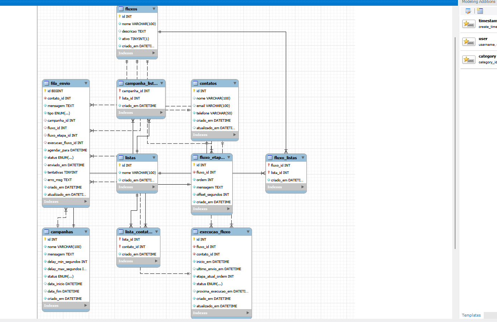

# DevSider - Sistema de Campanhas e Fluxos WPP

O **DevSider** é uma aplicação para gerenciamento e disparo de mensagens em massa (campanhas e fluxos automatizados) via WhatsApp.  
O sistema permite criar listas de contatos, importar arquivos CSV e agendar mensagens por meio de uma fila processada em background.

---

## 🏗️ Arquitetura

O projeto utiliza **Node.js** e segue uma arquitetura em camadas (Routes, Services, Repositories) com processamento assíncrono.

### **Componentes principais**
### **API REST (Express)**
Responsável por receber requisições HTTP, gerenciar listas, contatos, campanhas e fluxos.  
Ela não envia mensagens diretamente: apenas agenda inserindo registros na *fila de envio* no banco.

### **Background Worker**
Script separado (`src/worker/worker.js`) executado em loop contínuo lendo a fila no MySQL.  
Ele dispara mensagens, atualiza o status e agenda próximos passos de fluxos.

### **Banco de Dados (MySQL)**
Armazena toda a persistência do sistema usando `mysql2/promise` com pool de conexões.

### **Serviço de WhatsApp**
Centraliza a comunicação com o WPPConnect.  
Possui também **modo Mock** para desenvolvimento sem celular conectado.

### **Frontend Estático**
Interface simples em **HTML + CSS + JS** para importar contatos via CSV.

---

## 🛠️ Tecnologias Utilizadas
- Node.js  
- Express.js  
- MySQL  
- Axios (para chamadas ao WPPConnect)

---

## 🚀 Instalação e Configuração

### **1. Pré‑requisitos**
- Node.js instalado  
- MySQL local ou remoto

### **2. Instalar dependências**

```bash
npm install
```

### **3. Configuração do Banco (MySQL)**

Crie um banco (ex.: `devsider`) e execute os scripts SQL das tabelas:

O script completo do banco está aqui:

Execute no MySQL:

```bash
mysql -u root -p < database/schema.sql
```

➡️ [`database/schema.sql`](database/schema.sql)

## 🗺️ Modelagem do Banco



- listas
- contatos
- lista_contatos
- campanhas
- campanha_listas
- fluxos
- fluxo_etapas
- execucao_fluxo
- fila_envio
---
```


### **4. Criar arquivo `.env`**

```
# Configurações do Servidor
PORT=3000

# Configurações do Banco de Dados MySQL
```
DB_HOST=localhost
DB_USER=root
DB_PASS=SuaSenhaAqui
DB_NAME=devsider

```

# Configurações do WhatsApp (WPPConnect)
MOCK_WPP=true
WPPCONNECT_URL=http://localhost:21465
WPPCONNECT_SESSION=default
```

---

## ⚙️ Como Executar

### **Terminal 1 — Iniciar API**

```bash
npm run dev
# ou
npm start
```

Rodará em: **http://localhost:3000**

### **Terminal 2 — Iniciar Worker**

```bash
node src/worker/worker.js
```

Você verá:

```
Worker iniciado. Lendo fila...
```

---

## 🧪 Como Testar

### **1. Importação de CSV (Interface Web)**

Acesse:

```
http://localhost:3000
```

Crie um CSV com:

```
nome;email;telefone
```

Envie via frontend.

---

### **2. Criar Campanha (Insomnia/Postman)**

**POST /api/campanhas**

```json
{
  "nome": "Campanha Promocional",
  "mensagem": "Olá, confira nossa nova promoção!",
  "delay_min_segundos": 5,
  "delay_max_segundos": 10,
  "listaIds": [1]
}
```

### **3. Disparar Campanha**

```
POST /api/campanhas/1/disparar
```

Isso agenda registros na `fila_envio`.

---

### **3. Acompanhar Disparos**

Com `MOCK_WPP=true`, o terminal exibirá:

```
[MOCK WPP] Enviando para 5511999999999: Olá, confira nossa nova promoção!
```

---


